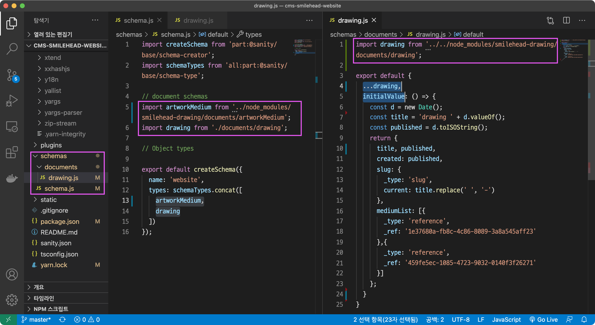
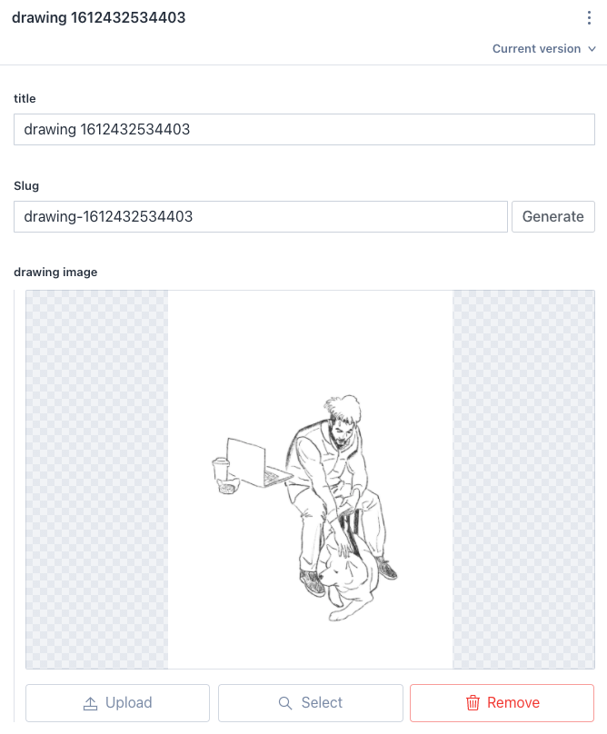
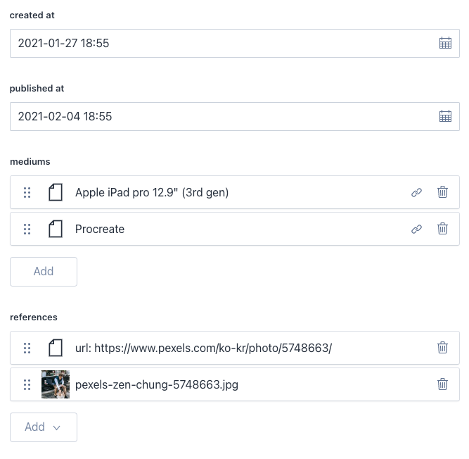

# How to Import?
Import directly "node_module/smilehead-drawing/index.js".
It depends on Sanity Studio project's bundling.
Because I don't have knowledge using module bundler.
Really sorry about that. I'll study it.

# Importing Example

You can give an "initialValue" as shown above. Check the "drawing.js" at the screenshot.

# Preview in Sanity Studio

